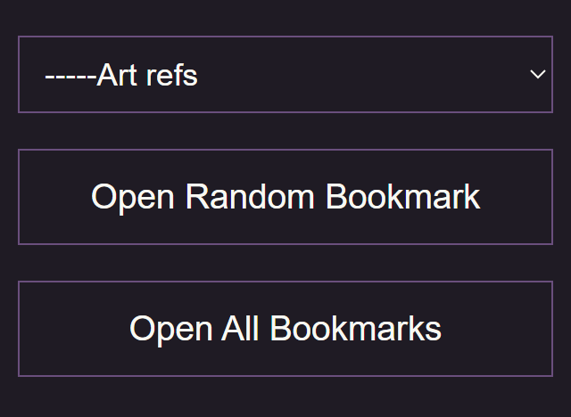

# Chrome-Bookmark-Tool

Custom chrome extension for additional bookmark functionality.

### Installation

Clone the files and enable developer mode in chrome, hit load unpacked and select the root path.

### Usage

Click extension pin to open menu, then select your desired bookmark folder.

You can use the buttons to open a random bookmark from the selected folder, or open ALL bookmarks from the selected folder.

### Future

Future development may include custom color themes, having the tool on the official chrome extension store, opening random bookmark sets, shuffling and other bookmark organizing, automated bookmark categorizing. I'll add stuff if I think it's valuable.
